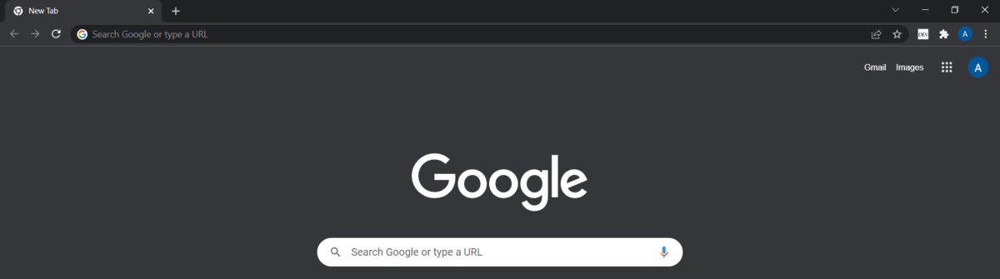

# localhost
A chrome extension - your little dev buddy.

[UPDATE] Firefox: [localhost](https://addons.mozilla.org/addon/localhost/)

Just a little fun stuff.

So, often while development lifecycle, we open up chrome and type localhost:XXXX and typing that 'localhost' takes quite a few keystrokes. One fine day, I was not in a good mood and funnily enough, I was getting irritated by the littlest of things and thought why not just the port number? :sweat_smile:

Sadly, to publish this, we need to pay open a google developer account and so I though instead. So here's the code. :disappointed:

To use the extension:

1. Clone this repo
    ```
    git clone git@github.com:abhishekpawl/localhost.git
    ```
    
2. Open up chrome, enable Developer mode and load unpacked extension(this project file).

And you're good to go.

Here's a little snippet:


